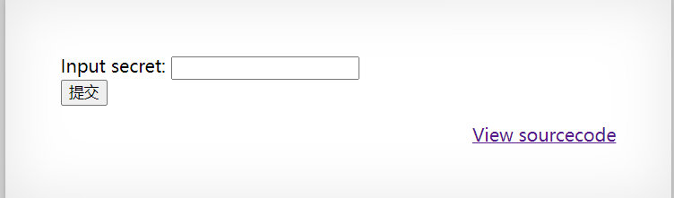

# OverTheWire Natas

[介绍页](https://overthewire.org/wargames/natas/)  
省流：反正就是用浏览器打开就行了  

## Level 0

```text
Username: natas0
Password: natas0
URL:      http://natas0.natas.labs.overthewire.org
```

## Level 0 -> Level 1

用浏览器打开，填账号密码就行啦  
然后嘛，下一关的密码就在注释里面，打开控制台就能看到了  
> 浏览器按F12打开控制台  

```
<div id="content">
You can find the password for the next level on this page.

<!--The password for natas1 is g9D9cREhslqBKtcA2uocGHPfMZVzeFK6 -->
</div>
```

### 密码

```
g9D9cREhslqBKtcA2uocGHPfMZVzeFK6
```

## Level 1 -> Level 2

> You can find the password for the next level on this page, but rightclicking has been blocked!  
> 合着我刚才那关用的右键->检查是吧(ˉ▽ˉ；)...  

还是一样，打开控制台就能找到，在注释里面  

```html
<!--The password for natas2 is h4ubbcXrWqsTo7GGnnUMLppXbOogfBZ7 -->
```

### 密码

```
h4ubbcXrWqsTo7GGnnUMLppXbOogfBZ7
```

## Level 2 -> Level 3

> There is nothing on this page  
> 没有东西我找啥(ˉ▽ˉ；)...  

打开控制台，能看到有一个单像素大小的图片，当然密码不会在图片里，303B的大小感觉不会是隐写的。  

```html
<div id="content">
There is nothing on this page

</div>
```

然后呢，这个图片有什么特别的？它是一个提示，因为可以往前面看看，其他关是没有这个图片的  
结合页面提示”这个页面什么都没有“所以，去看看这个图片的来源吧  
控制台查看元素，右键图片src=""里的部分，在新标签页中打开  
http://natas2.natas.labs.overthewire.org/files/pixel.png  
把这个链接改一下，去掉pixel.png就行了  
于是打开了natas2的文件目录页面  

```
Index of /files
[ICO]	Name	Last modified	Size	Description
[PARENTDIR]	Parent Directory	 	-	 
[IMG]	pixel.png	2023-10-05 06:15	303	 
[TXT]	users.txt	2023-10-05 06:15	145	 
Apache/2.4.52 (Ubuntu) Server at natas2.natas.labs.overthewire.org Port 80
```

> 大概就是这样，我直接复制粘贴纯文本的，能看出来就行（  

点击那个users.txt看看  

```
# username:password
alice:BYNdCesZqW
bob:jw2ueICLvT
charlie:G5vCxkVV3m
natas3:G6ctbMJ5Nb4cbFwhpMPSvxGHhQ7I6W8Q
eve:zo4mJWyNj2
mallory:9urtcpzBmH
```

ok密码就在这  

### 密码

```
G6ctbMJ5Nb4cbFwhpMPSvxGHhQ7I6W8Q
```

## Level 3 -> Level 4

> There is nothing on this page

一打开，又是这个，意味着，当前页面别想找到密码了，但是这个地址下面应该是有东西的  
看一下元素，这有个注释  
No more information leaks!! Not even Google will find it this time...  
怎么说好呢，他说Google也找不到，然后根据这个联想到`robots.txt`其实关于这个思路我还是觉得有点牵强，但是...  
这关真的是靠`robots.txt`， 那就这个逻辑吧（  
所以改一下链接，去看看`robots.txt`写了啥  
http://natas3.natas.labs.overthewire.org/robots.txt  

```
User-agent: *
Disallow: /s3cr3t/
```

好的，不然搜索引擎访问这个文件夹，那就去这个文件夹看看  
http://natas3.natas.labs.overthewire.org/s3cr3t/  
打开后会发现原来是一个文件目录，就和natas2一样，这里就不贴出来了，点users.txt就行了  

```
natas4:tKOcJIbzM4lTs8hbCmzn5Zr4434fGZQm
```

### 密码

```
tKOcJIbzM4lTs8hbCmzn5Zr4434fGZQm
```

## Level 4 -> Level 5

> Access disallowed. You are visiting from "" while authorized users should come only from "http://natas5.natas.labs.overthewire.org/"  
> 禁止访问。您从""访问，而授权用户只能从 "http://natas5.natas.labs.overthewire.org/"访问。

其实说的很清楚了，就是要从natas5来访问natas4，至于怎么访问，先打开natas5的页面  
弹出登录框直接点取消  
在这个未认证的页面打开控制台，使用js来跳转到natas4的页面  
`window.location.href = 'http://natas4.natas.labs.overthewire.org/';`  
等一会然后就跳转了，会弹出这个，密码的消息  

```
Access granted. The password for natas5 is Z0NsrtIkJoKALBCLi5eqFfcRN82Au2oD
```

### 密码

```
Z0NsrtIkJoKALBCLi5eqFfcRN82Au2oD
```

## Level 5 -> Level 6

因为一开始打开natas5，没有让我登录，直接弹出一个：  
> Access disallowed. You are not logged in  
所以我还以为是隐藏了http1.1的那个basic认证登录，后来清理cookie，又打开natas5发现有输入账号密码的弹窗了，所以应该是没关系的  

--- 

上面都是废话（ 

实际上就是，登录了，但是还是判断你没登录，然后我就登录了natas4和natas5，比较一下请求头，然后发现natas5有这一段，natas4没有  
Cookie:loggedin=0  

把这个放搜索引擎搜一下就大概知道了，改一下这个cookie的值就行了  
浏览器开发者工具->应用->cookie  
把那个0改成1，然后刷新页面  
> Access granted. The password for natas6 is fOIvE0MDtPTgRhqmmvvAOt2EfXR6uQgR  

### 密码

```
fOIvE0MDtPTgRhqmmvvAOt2EfXR6uQgR
```

## Level 6 -> Level 7

  

要填东西，要么是找到正确答案，要么是想办法绕过提交之类的，但是他都非常贴心的给了个源码链接了.......  
打开一看，这一段的提示已经非常明显了...  

```c++
<?

include "includes/secret.inc";

    if(array_key_exists("submit", $_POST)) {
        if($secret == $_POST['secret']) {
        print "Access granted. The password for natas7 is <censored>";
    } else {
        print "Wrong secret";
    }
    }
?>
```

> 实际上我不知道这是哪个语言的，反正是啥语言都不重要  

把这个`includes/secret.inc`加到natas6的链接看看是什么就行了  
http://natas6.natas.labs.overthewire.org/includes/secret.inc  

```c++
<?
$secret = "FOEIUWGHFEEUHOFUOIU";
?>
```

所以natas6要填入的内容就是这个`FOEIUWGHFEEUHOFUOIU`  
填进去提交，↓  
> Access granted. The password for natas7 is jmxSiH3SP6Sonf8dv66ng8v1cIEdjXWr  

### 密码

```
jmxSiH3SP6Sonf8dv66ng8v1cIEdjXWr
```

## Level 7 -> Level 8

### 密码

```
```

## Level 8 -> Level 9

### 密码

```
```

## Level 9 -> Level 10

### 密码

```
```

## Level 10 -> Level 11

### 密码

```
```

## Level 11 -> Level 12

### 密码

```
```

## Level 12 -> Level 13

### 密码

```
```

## Level 13 -> Level 14

### 密码

```
```

## Level 14 -> Level 15

### 密码

```
```

## Level 15 -> Level 16

### 密码

```
```

## Level 16 -> Level 17

### 密码

```
```

## Level 17 -> Level 18

### 密码

```
```

## Level 18 -> Level 19

### 密码

```
```

## Level 19 -> Level 20

### 密码

```
```

## Level 20 -> Level 21

### 密码

```
```

## Level 21 -> Level 22

### 密码

```
```

## Level 22 -> Level 23

### 密码

```
```

## Level 23 -> Level 24

### 密码

```
```

## Level 24 -> Level 25

### 密码

```
```

## Level 25 -> Level 26

### 密码

```
```

## Level 26 -> Level 27

### 密码

```
```

## Level 27 -> Level 28

### 密码

```
```

## Level 28 -> Level 29

### 密码

```
```

## Level 29 -> Level 30

### 密码

```
```

## Level 30 -> Level 31

### 密码

```
```

## Level 31 -> Level 32

### 密码

```
```

## Level 32 -> Level 33

### 密码

```
```

## Level 33 -> Level 34

### 密码

```
```
